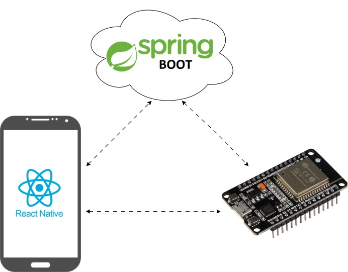
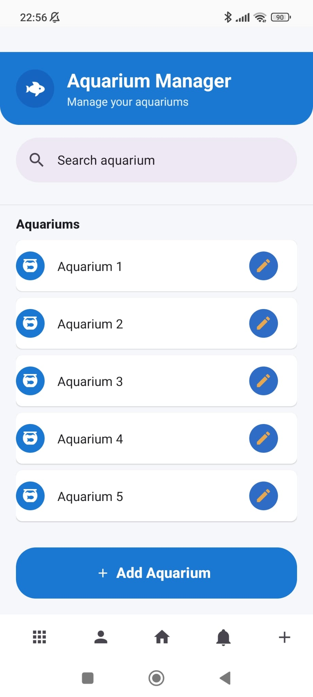
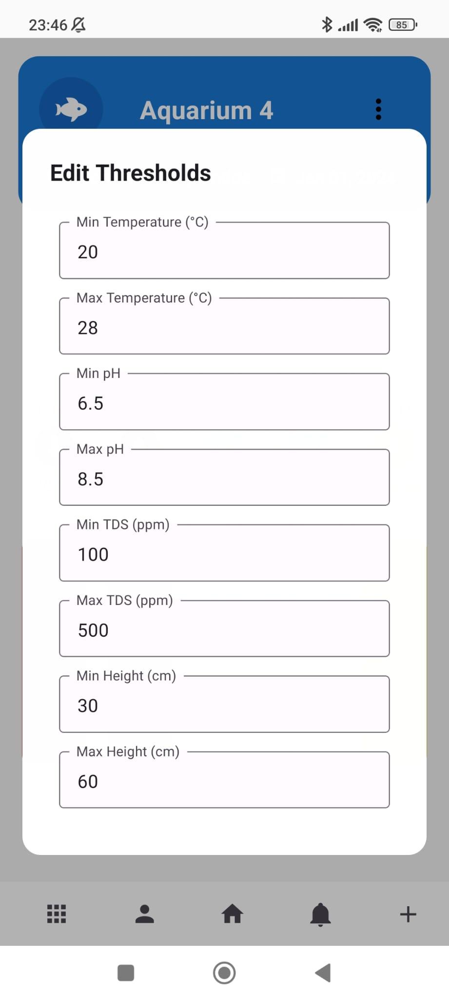
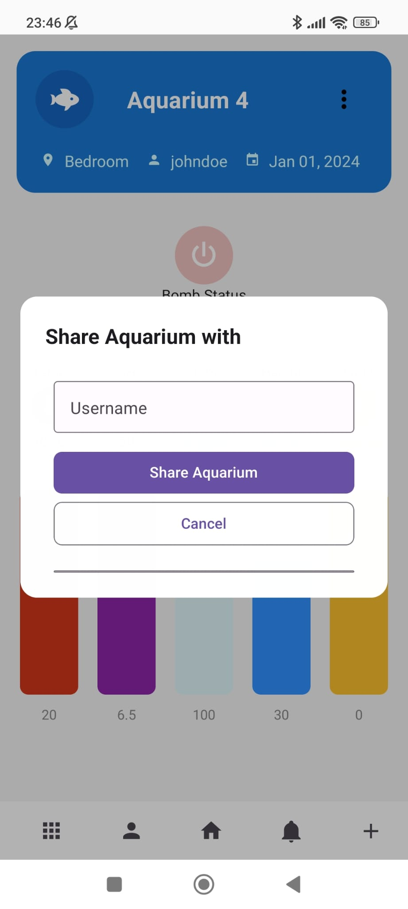
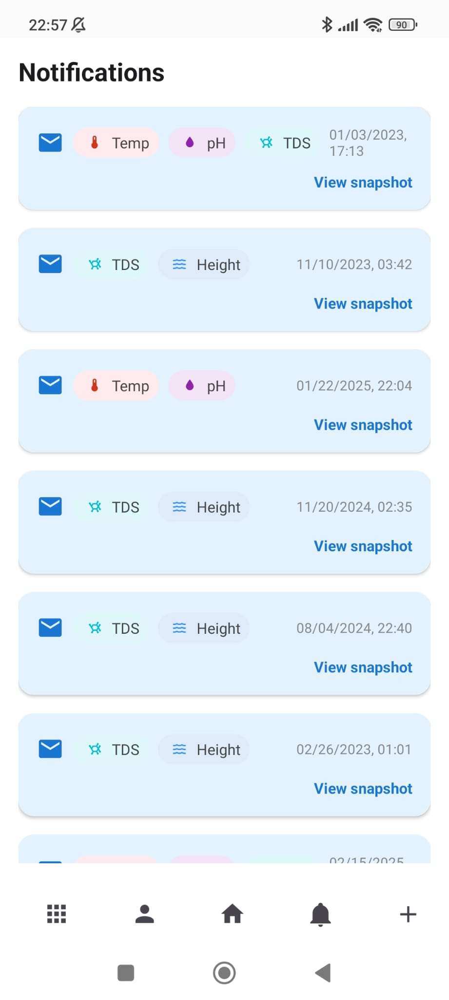
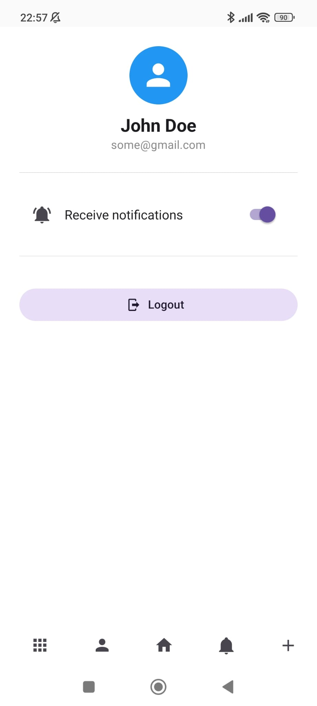
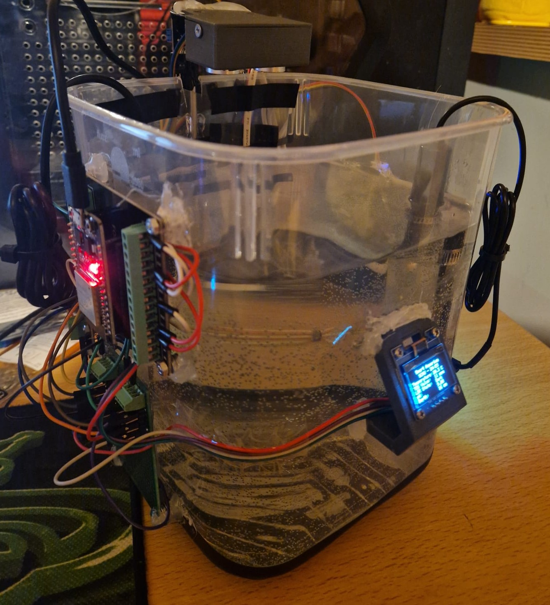
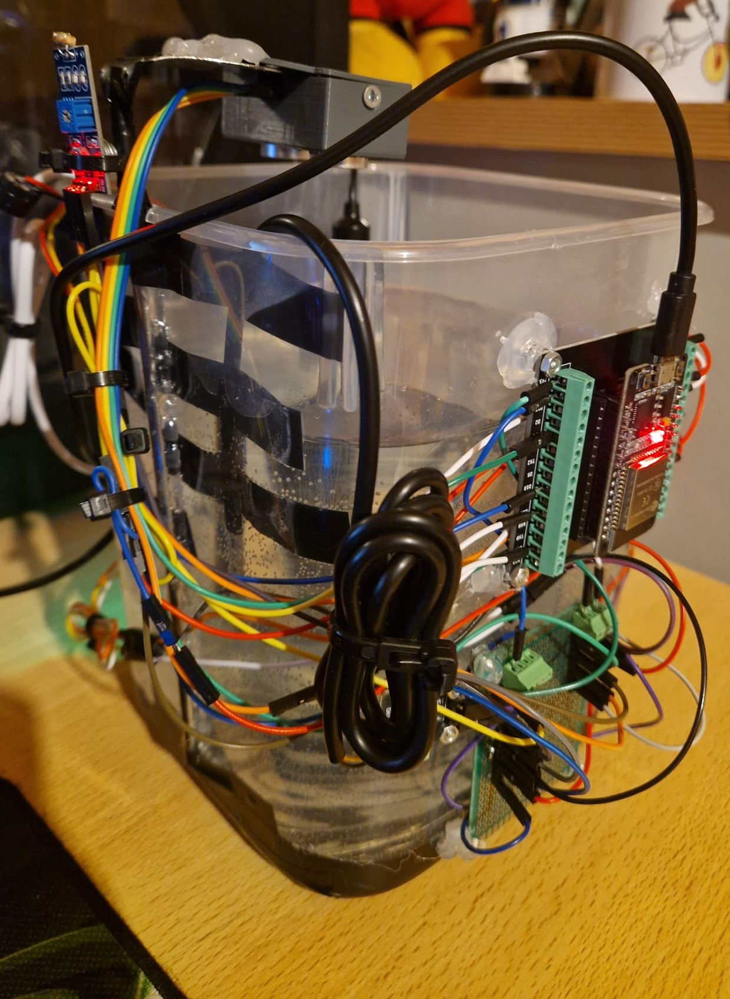
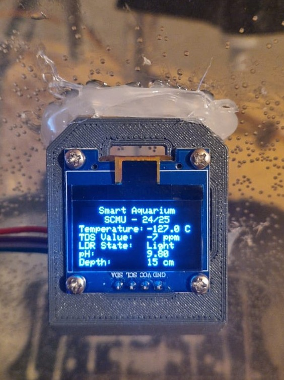
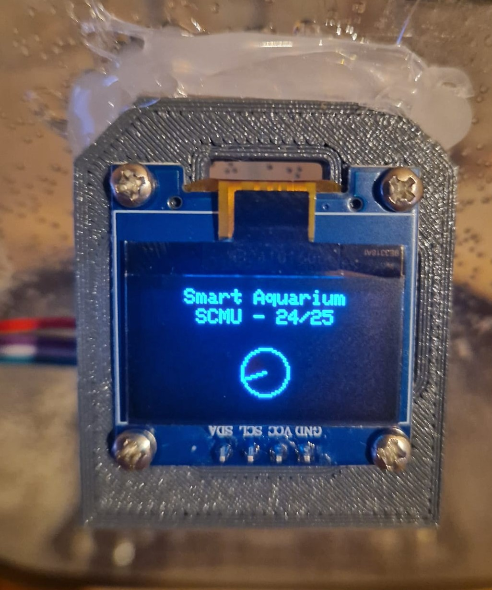

# 🐠 Smart Aquarium IoT System

An intelligent IoT-powered system for monitoring and managing multiple aquariums using ESP32 microcontrollers, a Spring Boot backend, and a React Native mobile application.

---

## 📋 Table of Contents

- [Overview](#-overview)
- [Features](#-features)
- [System Architecture](#-system-architecture)
- [Hardware Components](#-hardware-components)
- [Mobile Application](#-mobile-application)
- [Technology Stack](#-technology-stack)
- [Getting Started](#-getting-started)
- [Project Structure](#-project-structure)
- [Experiments & Prototype](#-experiments--prototype)
- [Lessons Learned](#-lessons-learned)

---

## 🌊 Overview

The **Smart Aquarium** is an IoT system designed to simplify the care and maintenance of multiple aquariums, ideal for pet shops or collectors. By continuously monitoring environmental conditions and responding automatically to undesirable changes, the system ensures a healthy and stable habitat for aquatic life with minimal manual effort.



### Key Capabilities

- **Real-time Monitoring**: Track temperature, pH, TDS, water level, and light conditions
- **Automated Response**: Automatic alerts and actions when thresholds are exceeded
- **Multi-Aquarium Management**: Support for multiple users and aquariums
- **Remote Control**: Monitor and control aquariums from anywhere via mobile app
- **Collaborative Sharing**: Share aquarium access with other users

---

## ✨ Features

### 🔍 Monitoring

- **Temperature Sensor**: Monitors water temperature
- **TDS Sensor**: Measures Total Dissolved Solids concentration
- **pH Sensor**: Tracks water acidity/alkalinity
- **Ultrasonic Sensor**: Measures water level
- **LDR Sensor**: Detects ambient light levels

### 🎛️ Control & Alerts

- **OLED Display**: Real-time sensor readings on device
- **Buzzer**: Audio alerts when thresholds are exceeded
- **Water Pump**: Automatic or manual water refill
- **Push Notifications**: Mobile alerts for critical events

### 📱 Mobile App Features

- User authentication and registration
- View all owned and shared aquariums
- Real-time sensor data display
- Historical data tracking (snapshots)
- Configurable threshold settings
- Manual pump control
- Aquarium grouping for organization
- Share aquarium access with other users
- Bluetooth pairing with ESP32 devices

---

## 🏗️ System Architecture

The system consists of three main layers:

### 1. Hardware Layer (ESP32 + Sensors)

- ESP32 microcontrollers manage sensors and actuators
- Initial setup via **Bluetooth Low Energy (BLE)** for Wi-Fi credential exchange
- Communication with backend over Wi-Fi using HTTPS
- MAC address-based device registration
- Non-volatile storage for Wi-Fi credentials

### 2. Backend Server (Spring Boot)

- **Technology**: Spring Boot 3.2.4, Java 21
- **Database**: MySQL for persistent storage
- **Cache**: Redis for performance optimization
- **Communication**: RESTful APIs, WebSockets, AMQP
- **Security**: JWT authentication, Spring Security
- **Deployment**: Docker container with Cloudflare Tunnel for remote access

### 3. Mobile Application (React Native)

- **Framework**: React Native with Expo
- **Language**: TypeScript
- **State Management**: React Query, Context API
- **BLE Integration**: React Native BLE PLX
- **UI**: React Native Paper components

---

## 🔧 Hardware Components

### ESP32 Board

- **Model**: Freenove FNK0046
- **Baud Rate**: 9600

### Sensors

| Sensor                | GPIO Pin | Voltage | Purpose           |
| --------------------- | -------- | ------- | ----------------- |
| Temperature (DS18B20) | GPIO 4   | 5V      | Water temperature |
| TDS Sensor            | GPIO 34  | 3.3V    | Water quality     |
| pH Sensor             | GPIO 25  | 3.3V    | Water acidity     |
| LDR                   | GPIO 35  | 3.3V    | Light detection   |
| Ultrasonic (Trigger)  | GPIO 12  | 5V      | Water level       |
| Ultrasonic (Echo)     | GPIO 14  | 5V      | Water level       |

### Actuators

| Actuator           | GPIO Pin | Voltage | Purpose      |
| ------------------ | -------- | ------- | ------------ |
| OLED Display (SDA) | GPIO 21  | 3.3V    | Data display |
| OLED Display (SCL) | GPIO 22  | 3.3V    | Data display |
| Buzzer             | GPIO 18  | -       | Audio alerts |
| Water Pump         | GPIO 19  | 3.3V    | Water refill |

### OLED Display Format

```
|   Smart Aquarium   |
|    SCMU - 24/25    |
|                    |
|Temperature: 25.4 C |
|TDS Value:   500 ppm|
|LDR State:   Light  |
|pH:          7.00   |
|Depth:       16 cm  |
```

---

## 📱 Mobile Application

### Authentication & Setup

<p align="center">
  
  &nbsp;&nbsp;&nbsp;&nbsp;
  
</p>

Users can create accounts or sign in to manage their aquariums securely.

### Aquarium Management

<p align="center">
  
  &nbsp;&nbsp;&nbsp;&nbsp;
  
</p>

The home screen displays all aquariums (owned and shared), with search functionality and quick access to add new devices. Each aquarium shows real-time sensor data and control options.

### History & Pairing

<p align="center">
  
  &nbsp;&nbsp;&nbsp;&nbsp;
  
</p>

View historical sensor snapshots to track environmental changes over time. The app guides users through Bluetooth pairing with new ESP32 devices.

### Groups & Organization

<p align="center">
  
  &nbsp;&nbsp;&nbsp;&nbsp;
  
</p>

Organize aquariums into groups (e.g., by pet shop, fish type, or location) for better management.

### Configuration & Sharing

<p align="center">
  
  &nbsp;&nbsp;&nbsp;&nbsp;
  
</p>

Configure custom threshold values for each parameter and easily share aquarium access with other users by username.

### Notifications & Alerts

<p align="center">
  
  &nbsp;&nbsp;&nbsp;&nbsp;
  
</p>

Receive real-time notifications when thresholds are exceeded and manage your profile settings.

---

## 💻 Technology Stack

### Backend

- **Framework**: Spring Boot 3.2.4
- **Language**: Java 21
- **Database**: MySQL
- **Cache**: Redis
- **Security**: JWT, Spring Security
- **Build Tool**: Maven
- **Containerization**: Docker

### Mobile App

- **Framework**: React Native (Expo)
- **Language**: TypeScript
- **State Management**: React Query, Context API
- **Bluetooth**: React Native BLE PLX
- **HTTP Client**: Axios
- **UI Library**: React Native Paper
- **Navigation**: Expo Router

### Hardware

- **Microcontroller**: ESP32 (Freenove FNK0046)
- **Programming**: Arduino IDE / C++
- **Libraries**:
  - DallasTemperature, OneWire (Temperature)
  - WiFi, HTTPClient (Networking)
  - ArduinoJson (JSON parsing)
  - Adafruit_GFX, Adafruit_SSD1306 (Display)
  - BLEDevice, BLEUtils, BLEServer (Bluetooth)
  - Preferences (Non-volatile storage)

---

## 🚀 Getting Started

### Prerequisites

- **Backend**: Java 21, Maven, MySQL, Docker (optional)
- **Mobile App**: Node.js, npm/yarn, Expo CLI
- **Hardware**: Arduino IDE, ESP32 board support

### Backend Setup

```bash
cd backend

# Configure database in application.properties
# Update MySQL connection settings

# Build the project
./mvnw clean install

# Run the application
./mvnw spring-boot:run

# Or use Docker
docker build -t smart-aquarium-backend .
docker run -p 8080:8080 smart-aquarium-backend
```

### Mobile App Setup

```bash
cd mobile-app/app

# Install dependencies
npm install

# Start development server
npm start

# Run on Android
npm run android

# Run on iOS
npm run ios
```

### ESP32 Setup

1. Open `esp32/esp32.ino` in Arduino IDE
2. Install required libraries (see `esp32/README.md`)
3. Configure board: ESP32 Freenove FNK0046
4. Set baud rate: 9600
5. Upload to ESP32
6. Use mobile app to pair via BLE and provide Wi-Fi credentials

---

## 📁 Project Structure

```
├── backend/                 # Spring Boot backend
│   ├── src/
│   │   ├── main/
│   │   │   ├── java/fct/project/scmu/
│   │   │   └── resources/
│   │   └── test/
│   ├── Dockerfile
│   └── pom.xml
│
├── mobile-app/app/         # React Native mobile application
│   ├── app/                # Screens and pages
│   ├── components/         # Reusable UI components
│   ├── context/            # State management
│   ├── hooks/              # Custom hooks (e.g., useBle)
│   ├── types/              # TypeScript type definitions
│   ├── utils/              # API clients and services
│   └── package.json
│
├── esp32/                  # ESP32 firmware
│   ├── esp32.ino           # Main Arduino sketch
│   ├── CredentialsCallback.h
│   ├── pitches.h
│   └── README.md
│
├── latex/                  # Project documentation
│   ├── main.tex            # LaTeX report source
│   ├── main.pdf            # Compiled report
│   └── Images/             # Screenshots and photos
│
└── README.md               # This file
```

---

## 🔬 Experiments & Prototype

During development, we conducted extensive testing to validate sensor accuracy, actuator responsiveness, and system reliability.

### Final Prototype

<p align="center">
  
  &nbsp;&nbsp;
  
</p>

<p align="center">
  
</p>

### Waiting Screen

<p align="center">
  
</p>

For better user experience, the OLED display shows a clock during initial setup (BLE and Wi-Fi connection) using multi-threading to avoid a blank screen.

---

## 📚 Lessons Learned

This project demonstrated the potential of ESP32 microcontrollers for creating smart, compact, and automated IoT systems. Key takeaways include:

### What Worked Well

- ✅ **BLE for Initial Configuration**: Effective for secure credential exchange
- ✅ **ESP32 Platform**: Powerful and flexible for IoT development
- ✅ **Real-time Communication**: Reliable data flow between services
- ✅ **Sensor Integration**: Successful multi-sensor data collection
- ✅ **Non-volatile Storage**: Persistent Wi-Fi credentials across reboots

### Future Improvements

- 🔐 Enhanced security mechanisms
- 📡 Over-the-air (OTA) firmware updates
- 🌍 GPS capabilities for device location tracking
- 🔋 Power optimization for battery operation
- 📊 Advanced analytics and predictive maintenance

---

## 📞 Authors

- José Costa - 62637
- Rodrigo Albuquerque - 70294
- Rafael Mira - 59243

**FCT-UNL** | **SCMU 2024/25**
