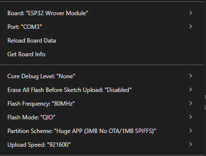

# ESP32 Docs

## Board Settings

- Board: ESP32 Freenove FNK0046



- Baud Rate: 9600

## Pins

- Temperature Sensor: GPIO 4 - **5V**
- TDS Sensor: GPIO 34 - **3.3V**
- LDR Sensor: GPIO 35 - **3.3V**
- Ultrasonic Sensor: - **5V**
  - Trigger Pin: GPIO 12
  - Echo Pin: GPIO 14
- pH Sensor: GPIO 25 - **3.3V**
- Buzzer: GPIO 18
- OLED Display: - **3.3V**
  - SDA: GPIO 21
  - SCL: GPIO 22
- Water Pump: GPIO 19 - **3.3V**

## Sensors checklist

- [x] Temperature Sensor
- [x] TDS Sensor
- [x] pH Sensor (needs calibration)
- [x] Light Sensor
- [x] Depth Sensor (Ultrasonic)

## Actuators checklist

- [x] OLED Display
- [ ] RGB LED
- [x] Buzzer
- [x] Water Pump

## OLED Representation

```markdown
|   Smart Aquarium   |
|    SCMU - 24/25    |
|                    |
|Temperature: 25.4 C |
|TDS Value:   500 ppm|
|LDR State:   Light  |
|pH:          7.00   |
|Depth:       16 cm  |
```

## Notes

3 liters in the bucket is 15.5 cm deep.

## Libraries Used

- DallasTemperature
- OneWire
- WiFi
- HTTPClient
- ArduinoJson
- Wire
- Adafruit_GFX
- Adafruit_SSD1306
- Preferences
- BLEDevice
- BLEUtils
- BLEServer
- BLE2902

## Bibliography

- <https://albertherd.com/2019/01/02/connecting-a-ds18b20-thermal-sensor-to-your-raspberry-pi-raspberry-pi-temperature-monitoring-part-1/>
- <https://www.youtube.com/watch?v=Vy650KLXIyY&ab_channel=ThalesFerreira>
- <https://wiki.keyestudio.com/KS0429_keyestudio_TDS_Meter_V1.0#TDS_Meter>
- <https://randomnerdtutorials.com/esp32-tds-water-quality-sensor>
- <https://esp32io.com/tutorials/esp32-ldr-module>
- <https://randomnerdtutorials.com/esp32-ssd1306-oled-display-arduino-ide/>
- <https://www.electroniclinic.com/waterproof-ultrasonic-sensor-jsn-sr04t-aj-sr04m-with-arduino-for-distance-measurement/>
- <https://www.electroniclinic.com/esp32-ph-sensor-iot-ph-sensor-code-and-circuit-diagram/#IoT_ESP32_pH_Sensor_Programming>
- <https://waterqualitygroup.my.site.com/MyHachCustomerService/s/article/KA-en-US-TE5202-1006439?language=en_US>
- <https://cdn.awsli.com.br/969/969921/arquivos/ph-sensor-ph-4502c.pdf>
- <https://github.com/vshymanskyy/Preferences>
- <https://esp32io.com/tutorials/esp32-button-piezo-buzzer>
- <https://github.com/hibit-dev/buzzer>
